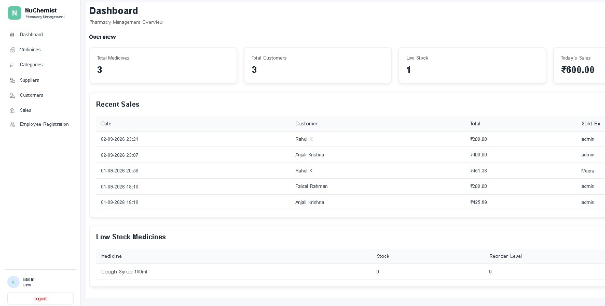
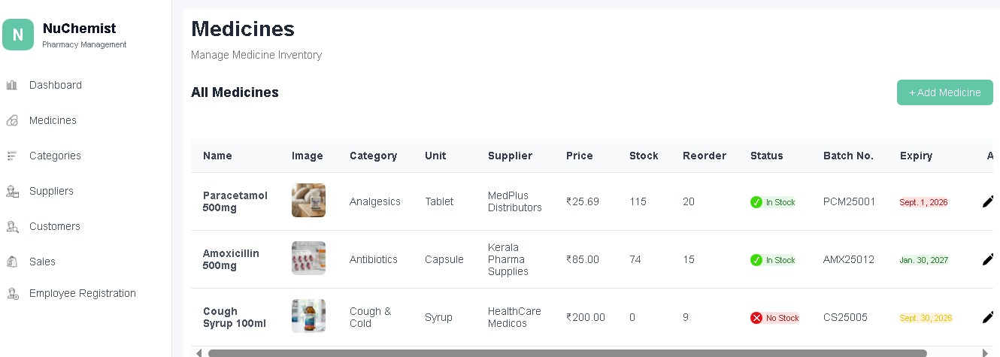
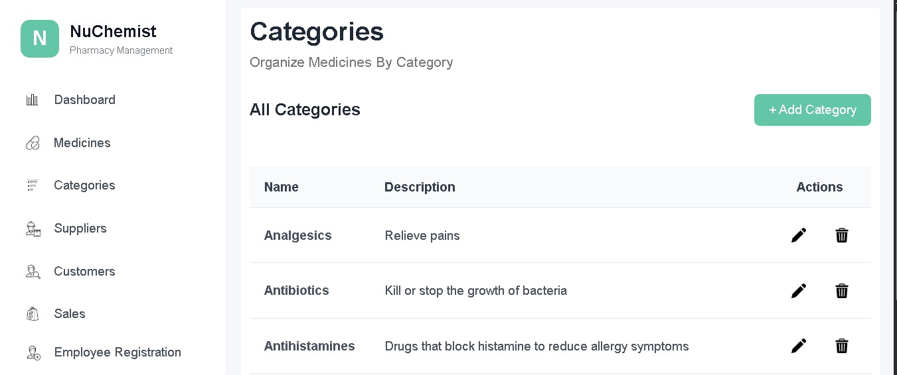
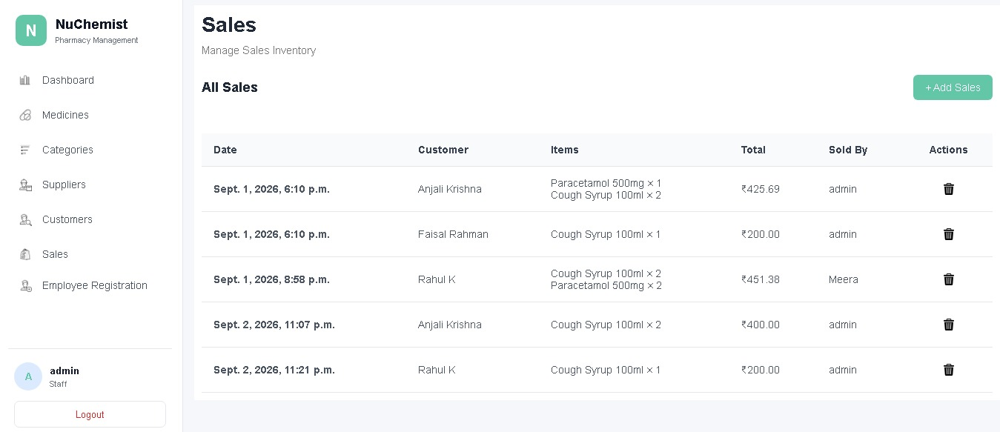

# Pharmacy Management System

A web-based **Pharmacy Management System** built with Django to manage medicines, customers, suppliers, stock, sales, and related pharmacy operations.



## 🚀 Features

* 🔐 User authentication
* 💊 Medicine management
* 📦 Stock management
* 👥 Customer management
* 🚚 Supplier management
* 💰 Sales management
* 📊 Sales and stock reports
* 🖼️ Image upload support
* ✏️ Create, update, and delete records
* 🛡️ Protected database operations

## 🛠️ Technologies Used

### Backend

* Python
* Django
* Django ORM

### Frontend

* HTML
* CSS
* JavaScript
* Bootstrap

### Database

* SQLite (development)

### Tools

* Git
* GitHub
* VS Code

## ⚙️ Installation

Clone the repository:

```bash
git clone YOUR_GITHUB_REPOSITORY_URL
cd YOUR_PROJECT_FOLDER
```

Create a virtual environment:

```bash
python -m venv venv
```

Activate the virtual environment.

### Windows

```bash
venv\Scripts\activate
```

Install dependencies:

```bash
pip install -r requirements.txt
```

Run migrations:

```bash
python manage.py migrate
```

Start the development server:

```bash
python manage.py runserver
```

Open:

```text
http://127.0.0.1:8000/
```

## 🔑 Environment Variables

For production, sensitive configuration such as the Django secret key and database credentials should be stored using environment variables.

Example:

```text
SECRET_KEY=your-secret-key
DEBUG=False
```

## 📸 Screenshots

### Medicines



### Category



### New Sale Registering


### Sale



## 📌 Project Status

🚧 **Development / Deployment**

The application is currently being prepared for deployment.

## 👨‍💻 Author

**Arjun**

Python Full Stack Developer

---

⭐ If you find this project useful, feel free to explore the repository.

